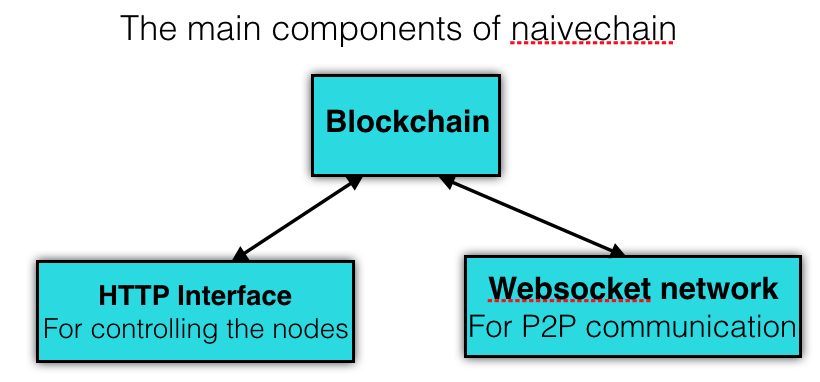
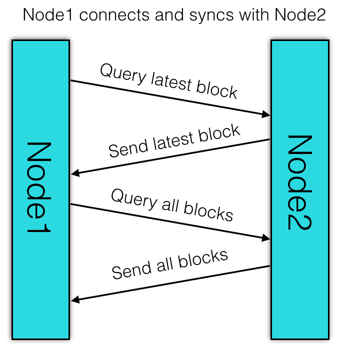
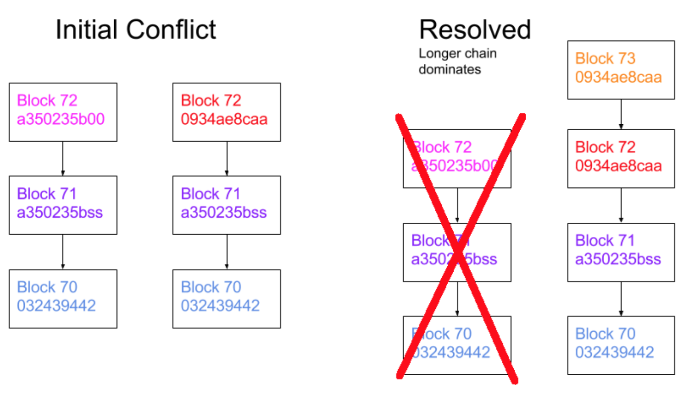
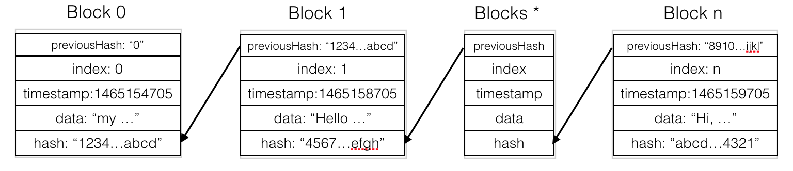
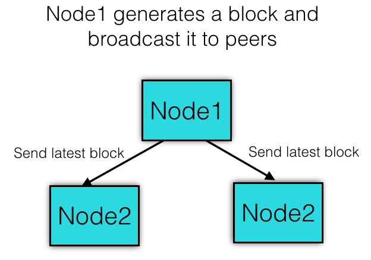

# naivechain的源码分析

#### 0. 架构
两个web服务，一个是http Server用来操控node节点，另一个是ws Server用于节点之间的通信。

图：The main components of naivechain


### 1. P2P网络
首先我们需要一个P2P网络，网络里的每个节点是对等，即可以做为服务端为其它节点提供服务，同时也可以做为客户端去请求其它节点的服务。WebSocket就是基于这样的场景发明的，它最大的特点就是服务器可以主动向客户端推送消息，客户端也可以主动向服务器发送信息，是真正的双向平等对话。WebSocket也是建立在TCP协议之上，协议标识符是ws（如果加密，则为wss），服务器网址就是 URL。且与HTTP协议有着良好的兼容性，而且默认端口也是80（http/ws）和443（https/wss），客户端与服务端的连接时使用的握手协议仍然采用HTTP协议。这个示例中使用的是ws：a Node.js WebSocket library。

区块链生存的基础是分布式网络，网络中存在很多对等的node，这些node相互通信并同步数据。这个示例中的节点功能很简单，满足以下基本功能：
1） 首先可以做为服务端等待其他节点的连接请求，连接成功的节点放入sockets数组中（peers节点），同时发出一次查询请求，查询最新的块。
2） 可以连接其它的peer节点，连接打开后，将连接的peer节点放入sockets数组中（peers节点），同时发出一次查询请求，查询最新的块。
3） 每个对等的节点可以接收消息，并按消息类型分别处理
4） 每个对等的节点可以处理连接错误和处理连接关闭事件，对于这两种情况都需要将连接从sockets（peers节点）中移除。

初始化连接：
```javascript
// 初始化连接
var initConnection = (ws) => {
    // 当前连接（peer）存入数组
    sockets.push(ws);
    initMessageHandler(ws);
    initErrorHandler(ws);
    // 向对端发送数据，数据内容是消息类型：MessageType.QUERY_LATEST
    write(ws, queryChainLengthMsg());
};
```
初始化P2P网络：
```javascript
// 初始化P2P Server
var initP2PServer = () => {
    var server = new WebSocket.Server({port: p2p_port});
    // 创建一个WS Server监听请求，每从有新的连接进入便初始化一个WebSocket实例
    server.on('connection', (ws) => initConnection(ws));
    console.log('listening websocket p2p port on: ' + p2p_port);
};
```
连接到peer节点：
```javascript
// 建立与peer的连接
var connectToPeers = (newPeers) => {
    console.log(newPeers);
    newPeers.forEach((peer) => {
        var ws = new WebSocket(peer);
        ws.on('open', () => initConnection(ws));
        ws.on('error', () => {
            console.log('connection failed')
        });
    });
};
```
对连接的错误处理：
```javascript
// 初始化错误处理
var initErrorHandler = (ws) => {
    var closeConnection = (ws) => {
        console.log('connection failed to peer: ' + ws.url);
        // 删除出错的peer
        sockets.splice(sockets.indexOf(ws), 1);
    };
    // 以下两种情况都关闭连接
    ws.on('close', () => closeConnection(ws));
    ws.on('error', () => closeConnection(ws));
};
```
对消息的分类处理：
```javascript
// 收到消息时，根据消息类型进行处理操作
var initMessageHandler = (ws) => {
    ws.on('message', (data) => { // 接收到消息时处理
        var message = JSON.parse(data);
        console.log('Received message' + JSON.stringify(message));
        switch (message.type) {
            case MessageType.QUERY_LATEST: // 返回最新的块数据
                write(ws, responseLatestMsg());
                break;
            case MessageType.QUERY_ALL: // 返回整个链上的块数据
                write(ws, responseChainMsg());
                break;
            case MessageType.RESPONSE_BLOCKCHAIN: // 收到整个链数据的消息，进行下一步处理
                handleBlockchainResponse(message);
                break;
        }
    });
};
```
说明：
1） MessageType.QUERY_LATEST： 节点收到查询最新块的请求，返回本节点最新的块数据
2） MessageType.QUERY_ALL： 节点收到查询所有块的请求，返回所有的块数据
3） MessageType.RESPONSE_BLOCKCHAIN： 节点收到查询的响应信息，进行下一步处理

图：Node1 connects and syncs with Node2


处理查询请求响应数据的处理逻辑：
```javascript
var handleBlockchainResponse = (message) => {
    // 按块高（index大小）升序排序
    var receivedBlocks = JSON.parse(message.data).sort((b1, b2) => (b1.index - b2.index));
    var latestBlockReceived = receivedBlocks[receivedBlocks.length - 1]; // peer节点上最新的块
    var latestBlockHeld = getLatestBlock(); // 本地链上最新的块
    if (latestBlockReceived.index > latestBlockHeld.index) { // 本地链长小于peer节点链（本地节点数据落后）
        console.log('blockchain possibly behind. We got: ' + latestBlockHeld.index + ' Peer got: ' + latestBlockReceived.index);
        if (latestBlockHeld.hash === latestBlockReceived.previousHash) { // 比本地链多的最新块正好是下一个块，直接追加
            console.log("We can append the received block to our chain");
            blockchain.push(latestBlockReceived);
            broadcast(responseLatestMsg());
        } else if (receivedBlocks.length === 1) { // 只有一个节点，需要向peer节点广播查询所有块数据
            console.log("We have to query the chain from our peer");
            broadcast(queryAllMsg());
        } else { // 本地链落后节点链很多块，进行替换操作
            console.log("Received blockchain is longer than current blockchain");
            replaceChain(receivedBlocks);
        }
    } else {
        console.log('received blockchain is not longer than received blockchain. Do nothing');
    }
};
```
说明：如果收到的block中索引最大值比本地最新的块的index值大，则分以下三种情况处理：
1） 收到的区块中索引最大的块的previousHash正好指向本地的最新块，则直接将该块追加到末尾
2） 收到的区块长度为1，则需要广播查询消息，查询所有块数据
3） 否则，用收到的链替换本地链

用新链替换本地链，然后将最新的块数据广播出去，其它节点收到消息后根据上面的逻辑进行判断
```javascript
// 使用新的链blocks替换本地的链blocks
var replaceChain = (newBlocks) => {
    if (isValidChain(newBlocks) && newBlocks.length > blockchain.length) {
        console.log('Received blockchain is valid. Replacing current blockchain with received blockchain');
        blockchain = newBlocks;
        broadcast(responseLatestMsg());
    } else {
        console.log('Received blockchain invalid');
    }
};
```
图： choosing the longest blockchain

### 2、 数据块(block)及区块链（blockchain)
2.1 首先是介绍block的结构，这里只定义了最基本的字段，交易数据使用data字段替代，如下：
* index： 区块链中块的索引，同时也代表了区块的高度
* previousHash：指向前一个区块的hash
* timestamp：生成块的时间戳
* data：数据字段
* hash：当前块（index+previousHash+timestamp+data）的hash
```javascript
// Block的结构，其中hash字段保存的是其它字段拼接后的hash
class Block {
    constructor(index, previousHash, timestamp, data, hash) {
        this.index = index;
        this.previousHash = previousHash.toString();
        this.timestamp = timestamp;
        this.data = data;
        this.hash = hash.toString();
    }
}
```
2.2 创世块，索引为0，previousHash为"0"
```javascript
// 创世块
var getGenesisBlock = () => {
    return new Block(0, "0", 1465154705, "my genesis block!!", "816534932c2b7154836da6afc367695e6337db8a921823784c14378abed4f7d7");
};
```
2.3 区块链，一个block数组，保存所有生成的合法的块，初始时填入创世块
```javascript
// 初始化区块链，并将创世块做为第一个块
var blockchain = [getGenesisBlock()];
```
注： 这个示例没有序列化区块链，区块链只存在于各节点的内存中，每次重启后重新初始化
2.4 计算区块的hash，这里只对关键数据用sha-256计算一次
```javascript
// 计算块的hash
var calculateHashForBlock = (block) => {
    return calculateHash(block.index, block.previousHash, block.timestamp, block.data);
};
// 计算传入各参数拼接后的hash
var calculateHash = (index, previousHash, timestamp, data) => {
    return CryptoJS.SHA256(index + previousHash + timestamp + data).toString();
};
```
图： Blockchain Structure of Naivechain


2.5 增加一个区块（相当于“挖矿”），并将新区快加入本地链上，在加入链上是还要做进一步的合法性验证，验证通过后将新块加入本地链上，并向全网广播新产生的块
```javascript
// 如果新生成的区块合法则加入链上，
var addBlock = (newBlock) => {
    if (isValidNewBlock(newBlock, getLatestBlock())) {
        blockchain.push(newBlock);
    }
};

// 根据上一区块，验证当前区块（newBlock）是否合法
var isValidNewBlock = (newBlock, previousBlock) => {
    // 当前区块的index + 1
    if (previousBlock.index + 1 !== newBlock.index) {
        console.log('invalid index');
        return false;
    // 当前区块的previousHash指向前一区块
    } else if (previousBlock.hash !== newBlock.previousHash) {
        console.log('invalid previoushash');
        return false;
    // 计算当前区块的hash值并与块中保存的hash值比对，判断是否一致
    } else if (calculateHashForBlock(newBlock) !== newBlock.hash) {
        console.log(typeof (newBlock.hash) + ' ' + typeof calculateHashForBlock(newBlock));
        console.log('invalid hash: ' + calculateHashForBlock(newBlock) + ' ' + newBlock.hash);
        return false;
    }
    return true;
};
```
注： 这个示例中没有挖矿和共识机制，只是模拟了某个节点产生新块并通过广播同步给其它节点情况。
图： Generate a new block and broadcast it


### 3、 Web API
另外，本示例还提供了几个web api让客户端可以与node进行交互：
1） get /blocks：返回所有的块数据
2)  post /mineBlock: 提交data数据到节点，然后生成新的区块
3)  get /peers: 查询节点的对等节点
4)  post /addPeer： 给节点增加对等节点
```javascript
// 初始化Http Server，响应客户端的请求
var initHttpServer = () => {
    var app = express();
    app.use(bodyParser.json());

    app.get('/blocks', (req, res) => res.send(JSON.stringify(blockchain)));
    app.post('/mineBlock', (req, res) => {
        console.log("Received data from client: " + req.body.data);
        var newBlock = generateNextBlock(req.body.data);
        addBlock(newBlock);
        broadcast(responseLatestMsg());
        console.log('block added: ' + JSON.stringify(newBlock));
        res.send();
    });
    app.get('/peers', (req, res) => {
        res.send(sockets.map(s => s._socket.remoteAddress + ':' + s._socket.remotePort));
    });
    app.post('/addPeer', (req, res) => {
        connectToPeers([req.body.peer]);
        res.send();
    });
    app.listen(http_port, () => console.log('Listening http on port: ' + http_port));
};
```

### 4、在Docker环境运行
本示例可以在Docker中部署运行，相关的两个文件分别是：Dockerfile和docker-compose.yml
* Dockerfile
Dockerfile定义了Container的运行环境, 其中PEERS是环境变量，启动时会传给运行的程序。对于node.js可以通过process.env获取。

* docker-compose.yml
这个文件定义了如何部署多个服务，每个服务可以有多个副本，所占资源等。在这示例中我们定义了3个服务：node1/2/3。初始时，node2和node3都把node1作为自己的一个对等节点。另外，这3个服务启动端口都是3001，但对外映射的端口分别为3001/2/3，即外部对这3个端口会分别映射到不同的服务节点。

#### 4.1 创建镜像
```
$ docker build -t naivechain .
Sending build context to Docker daemon  3.191MB
Step 1/8 : FROM node:4.6
...(snipped)...
Step 2/8 : RUN mkdir /naivechain
...(snipped)...
Step 3/8 : ADD package.json /naivechain/
...(snipped)...
Step 4/8 : ADD main.js /naivechain/
...(snipped)...
Step 5/8 : RUN cd /naivechain && npm install
...(snipped)...
Step 6/8 : EXPOSE 3001
...(snipped)...
Step 7/8 : EXPOSE 6001
...(snipped)...
Step 8/8 : ENTRYPOINT cd /naivechain && npm install && PEERS=$PEERS npm start
...(snipped)...

Successfully built c42428a8a12d
Successfully tagged naivechain:latest
```
#### 4.2 查看
```
$ docker image ls naivechain
REPOSITORY          TAG                 IMAGE ID            CREATED             SIZE
naivechain          latest              c42428a8a12d        15 minutes ago      652MB
```

#### 4.3 初始化swarm
```
$ docker swarm init
```

#### 4.4 部署并运行
```
// 部署并运行
$ docker stack deploy -c docker-compose.yml naivechain
// take down
$ docker stack rm naivechain
// stop swarm
$ docker swarm leave --force
```
#### 4.5 查看日志
```
$ docker container ls
$ docker logs --details -f <container>
# or 查看node1的日志
$ docker logs --details -f $(docker ps | grep node1 | awk -F"[ ]+" '{print $1}')
```

### 5 测试
#### 5.1 查询个节点的对等节点
```
$ curl http://localhost:3001/peers
["10.0.0.5:44856"]%
$ curl http://localhost:3002/peers
["10.0.0.2:6001","10.0.0.7:53312"]%
$ curl http://localhost:3003/peers
["10.0.0.4:6001"]%
```
#### 5.2 查询某一节点的all blocks (即blockchain)
```
$ curl http://localhost:3003/blocks | python -mjson.tool
[
    {
        "data": "my genesis block!!",
        "hash": "816534932c2b7154836da6afc367695e6337db8a921823784c14378abed4f7d7",
        "index": 0,
        "previousHash": "0",
        "timestamp": 1465154705
    }
]
```
#### 5.3 增加一个bloc块
```
curl -H "Content-type:application/json" --data '{"data" : "hello, node-2!!!!"}' http://localhost:3002/mineBlock
```

#### 5.4 增加一个peer节点
```
curl -H "Content-type:application/json" --data '{"peer" : "ws://node3:6001"}' http://localhost:3001/addPeer
```

### 6 未来计划
#### 6.1 增加挖矿和共识
